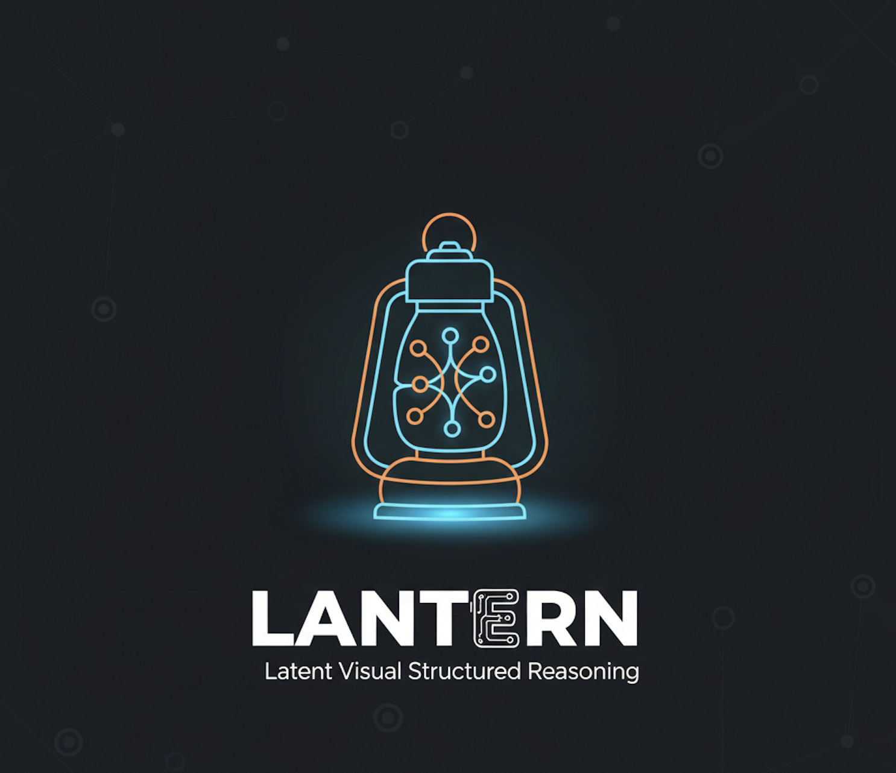

# LantErn: Latent Visual Structured Reasoning

<p align="center">
  
</p>


> **Interleaved Reasoning between text (verbalized form) and visual representations (non-verbalized forms)**

LantErn is a vision-language model that enables interleaved reasoning between text and compressed visual representations. It extends Qwen2.5-VL models to learn and generate latent visual reasoning tokens, allowing the model to reason about visual content in a compressed, non-verbalized form.

## Overview

LantErn introduces **Latent Visual Reasoning (LVR)** tokens that represent visual reasoning steps in a compressed embedding space. Instead of always generating text tokens, the model can generate these special latent tokens that encode visual reasoning information, enabling more efficient and effective multimodal reasoning.

### Key Concepts

- **Latent Visual Reasoning (LVR)**: Special tokens (`<|lvr_start|>`, `<|lvr_sep|>`, `<|lvr_end|>`) that represent compressed visual reasoning embeddings
- **Interleaved Reasoning**: The model alternates between generating text reasoning and latent visual representations
- **Visual Compression**: Visual features from cropped image regions are compressed into a fixed number of latent tokens (configurable via `latent_size`)

## Features

- 🎯 **Latent Visual Reasoning**: Generate compressed visual reasoning tokens instead of verbose text descriptions
- 🔄 **Interleaved Generation**: Seamlessly switch between text and visual reasoning during generation
- 🎓 **Supervised Fine-tuning**: Train on datasets with visual reasoning traces (e.g., VisCoT)
- 📊 **Evaluation Framework**: Built-in evaluation with LLM-based judge for open-ended answers
- 🚀 **DeepSpeed Support**: Efficient distributed training with DeepSpeed ZeRO optimization
- 🎛️ **Flexible Training**: Freeze/unfreeze vision tower, merger, and LLM components independently

## Installation

### Prerequisites

- Python >= 3.8
- CUDA-capable GPU(s)
- PyTorch >= 1.13.0
- DeepSpeed >= 0.9.0 (for distributed training)

### Setup

1. Clone the repository:
```bash
git clone https://github.com/GuilhermeViveiros/LantErn.git
cd LantErn
```

2. Install dependencies:
```bash
pip install -r requirements.txt
```

3. Install the package in development mode:
```bash
pip install -e .
```

### Optional Dependencies

For Weights & Biases logging:
```bash
pip install wandb
```

## Project Structure

```
LantErn/
├── src/
│   ├── train/              # Training scripts
│   │   └── train.py       # Main training entry point
│   ├── models/             # Model implementations
│   │   ├── __init__.py     # Model loading utilities
│   │   ├── qwen2_5VL/      # Qwen2.5-VL modifications
│   │   └── utils.py        # Latent compression utilities
│   ├── lantern_generate/   # Custom generation logic
│   │   └── generate.py      # Latent-aware generation
│   ├── datasets/           # Dataset handling
│   │   └── sft_data.py     # SFT dataset and collators
│   ├── trainer/            # Custom trainer
│   │   └── sft_trainer.py  # LantErn SFT trainer with latent loss
│   ├── judge.py            # LLM-based evaluation judge
│   ├── test.py             # Evaluation script
│   └── params.py           # Configuration dataclasses
├── scripts/
│   ├── finetune_lantern_sft_3b.sh  # Training script example
│   ├── eval_viscot.sh              # Evaluation script
│   └── zero*.json                  # DeepSpeed configurations
├── requirements.txt
├── setup.py
└── README.md
```

## Usage

### Training

Train a LantErn model using supervised fine-tuning:

```bash
python -m src.train.train \
    --model_id "Qwen/Qwen2.5-VL-3B-Instruct" \
    --data_path /path/to/data.json \
    --output_dir /path/to/checkpoints \
    --latent_size 4 \
    --per_device_train_batch_size 8 \
    --gradient_accumulation_steps 4 \
    --learning_rate 1e-5 \
    --num_train_epochs 1 \
    --bf16 \
    --gradient_checkpointing \
    --freeze_vision_tower \
    --freeze_merger \
    --gamma 0.1
```

#### With DeepSpeed

For multi-GPU training with DeepSpeed:

```bash
deepspeed src/train/train.py \
    --deepspeed scripts/zero3.json \
    --model_id "Qwen/Qwen2.5-VL-3B-Instruct" \
    --data_path /path/to/data.json \
    --output_dir /path/to/checkpoints \
    --latent_size 4 \
    --per_device_train_batch_size 8 \
    --gradient_accumulation_steps 4 \
    --learning_rate 1e-5 \
    --num_train_epochs 1 \
    --bf16 \
    --report_to wandb
```

#### Training Script Example

See `scripts/finetune_lantern_sft_3b.sh` for a complete training example with SLURM.

### Evaluation

Evaluate a trained model on the VisCoT dataset:

```bash
python -m src.test \
    --model_ref /path/to/checkpoint \
    --data_path /path/to/LantErn_VisCot_data.json
```

#### With SLURM

```bash
sbatch scripts/eval_viscot.sh [checkpoint_path] [data_path]
```

The evaluation script:
- Generates answers using the model
- Extracts predicted latent embeddings
- Uses an LLM judge (Qwen2.5-VL-3B-Instruct) to score answers
- Computes accuracy, average score, and latent generation ratio

### Generation

The model uses a custom generation function that handles latent tokens. During generation:

1. When `<|lvr_start|>` is predicted, the model enters latent mode
2. Instead of generating text tokens, it generates hidden states as latent embeddings
3. After `latent_size` tokens, it generates `<|lvr_end|>` and returns to text generation

## Configuration

### Model Parameters

- `model_id`: Base model identifier (default: `"Qwen/Qwen2.5-VL-3B-Instruct"`)
- `latent_size`: Number of latent tokens per visual reasoning step (default: `4`)
- `use_cache`: Whether to use KV cache during generation (default: `False`)

### Training Parameters

- `gamma`: Weight for the cross-entropy loss vs. MSE loss for latents (default: `0.1`)
- `freeze_vision_tower`: Freeze vision encoder weights (default: `True`)
- `freeze_merger`: Freeze vision-text merger weights (default: `True`)
- `freeze_llm`: Freeze LLM weights (default: `False`)
- `gradient_checkpointing`: Enable gradient checkpointing to save memory (default: `True`)
- `bf16` / `fp16`: Mixed precision training

### Data Parameters

- `data_path`: Path to JSON dataset file
- `dummy`: Use only first 1000 samples for quick testing (default: `False`)
- `shuffle_dataset`: Shuffle dataset before splitting (default: `True`)
- `split_percentages`: Train/val/test split ratios (default: `(0.9, 0.1, 0.0)`)

See `src/params.py` for all available parameters.

## Data Format

LantErn expects JSON data in the following format:

```json
{
  "question": "What is in the image?",
  "img_path": "/path/to/image.jpg",
  "bboxs": [[x1, y1, x2, y2], ...],
  "reasoning_traces": {
    "pre_visual_text_think": "First, I need to identify...",
    "post_visual_latent_reasoning": ["After looking at the region, I see...", ...],
    "text_think": "Based on the visual information...",
    "answer": "A cat sitting on a mat"
  }
}
```

**Fields:**
- `question`: The question to answer
- `img_path`: Path to the input image
- `bboxs`: List of bounding boxes for visual reasoning regions
- `reasoning_traces`:
  - `pre_visual_text_think`: Text reasoning before visual inspection (optional)
  - `post_visual_latent_reasoning`: Text reasoning after each visual region (list, one per bbox)
  - `text_think`: Text-only reasoning (alternative to visual reasoning)
  - `answer`: Final answer

**Note:** The number of `bboxs` must match the length of `post_visual_latent_reasoning`.

## Technical Details

### Latent Visual Reasoning

During training:
1. Visual regions (from bounding boxes) are processed through the vision encoder
2. Visual features are compressed into `latent_size` tokens via averaging
3. These compressed embeddings replace `<|lvr_sep|>` token embeddings
4. The model learns to predict these compressed embeddings in its hidden states

During generation:
1. When latent mode is triggered, the model generates hidden states instead of text tokens
2. These hidden states represent the compressed visual reasoning
3. The model can switch back to text generation after latent reasoning

### Loss Function

The training loss combines:
- **Cross-entropy loss**: For text token prediction
- **MSE loss**: For latent embedding prediction

```
loss = γ * CE_loss + MSE_loss
```

Where `γ` (gamma) controls the relative weight of the text loss.

### Special Tokens

- `<|lvr_start|>`: Marks the beginning of latent visual reasoning
- `<|lvr_sep|>`: Placeholder token replaced with latent embeddings (during training)
- `<|lvr_end|>`: Marks the end of latent visual reasoning

## Evaluation Metrics

The evaluation framework reports:
- **Average Score**: Mean judge score (0-1) across all samples
- **Accuracy**: Percentage of samples with score > 0.5
- **Invalid Ratio**: Percentage of samples that failed evaluation
- **Latent Ratio**: Percentage of samples that generated latent tokens


## Troubleshooting

### Common Issues

1. **Out of Memory**: Reduce `per_device_train_batch_size` or enable `gradient_checkpointing`
2. **CUDA Errors**: Ensure PyTorch and CUDA versions are compatible
3. **Token Embedding Size Mismatch**: The model automatically resizes embeddings when special tokens are added
4. **Data Loading Errors**: Verify data format matches expected schema and image paths are accessible

### Debug Mode

Use `--dummy True` to quickly test with a small subset of data:

```bash
python -m src.train.train \
    --dummy True \
    --data_path /path/to/data.json \
    ...
```

## Citation

If you use LantErn in your research, please cite:

```bibtex
@software{lantern2024,
  title={LantErn: Interleaved Reasoning between Text and Visual Representations},
  author={Viveiros, Guilherme and others},
  year={2024},
  url={https://github.com/GuilhermeViveiros/LantErn}
}
```


Contributions are welcome! Please feel free to submit a Pull Request.
